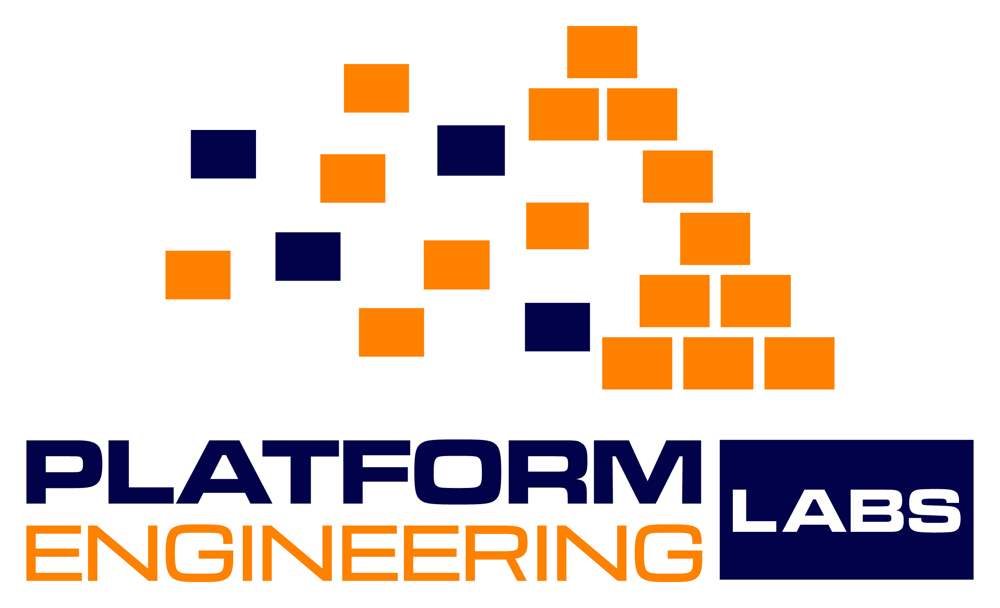

<picture>
  <source media="(prefers-color-scheme: dark)" srcset="assets/logo.png">
  
</picture>

### Rebooting software delivery for humans and agents in the AI era.

 

 

Platform Engineering Labs is rebooting the software delivery stack for humans and agents: [formae](https://formae.ai) for infrastructure, [Orbital](https://github.com/platform-engineering-labs/orbital) for packaging, Hangar for the registry, and [AppShuttle](https://appshuttle.ai) for delivery.

The software delivery stack was built for human workflows at human speed, and it no longer holds. Agents ship at volume; vibe-coded apps need the shortest path to production. So we are rebooting the stack: the obsolete rituals and ceremonies go, and what is left is a smaller set of tools with the automation already built into them.

## What we offer

### [formae Cloud](https://formae.ai/formae-cloud)

`fully managed`

Fully managed by us. No ticket to raise, no platform to learn, no DevOps to hire or wait on. You just talk to infrastructure. Everything automatically stays in order, there before you need it, and nobody babysits it. Works for AWS, GCP and Azure.

Nothing to adopt · Nothing to own · No DevOps to hire · Structure without effort

### [formae IaC](https://formae.ai/formae-iac)

`free` `open source`

Self-hosted and fully yours: Infrastructure As Code for the AI era. Stop pretending your legacy IaC repository describes reality. formae IaC starts with what exists, catches and versions out-of-band changes, and hands you always-current code to evolve.

No drift · Minimal blast radius · Always-current code · Full control

A [Terraform](https://formae.ai/formae-vs-terraform) and [Pulumi](https://formae.ai/formae-vs-pulumi) alternative built for day 2 and beyond: formae defines infrastructure in Pkl, a configuration language with schemas and constraints, then continuously discovers what is actually running and keeps that code as the source of truth rather than a state file. It can fully replace Terraform or Pulumi, or run alongside them.

- [formae](https://github.com/platform-engineering-labs/formae) - the source, written in Go. Open source under FSL-1.1-ALv2; every release converts to Apache-2.0 after two years.
- [formae plugin](https://github.com/platform-engineering-labs/formae-mcp) (formerly `formae-mcp`) - MCP server and skills for Claude Code, Codex, Cursor and OpenCode. In Claude Code, install it as `formae` from the [formae-marketplace](https://github.com/platform-engineering-labs/formae-marketplace).
- [formae hub](https://hub.platform.engineering) - community and official plugins: AWS, Azure, GCP, OCI, Kubernetes and more. Write your own from the [plugin template](https://github.com/platform-engineering-labs/formae-plugin-template).
- [formae-helm](https://github.com/platform-engineering-labs/formae-helm) - run the formae agent on Kubernetes.
- [Documentation](https://docs.formae.ai) - reference, guides and release notes.

### [Orbital](https://github.com/platform-engineering-labs/orbital)

`alpha` `open source`

Developer-friendly packaging system. Just ship software, safely. Packaging rebooted for the AI era. No legacy baggage to fight, no archaic build system to adopt. Just point it at your software directory, and ship it.

S3 bucket repositories · Secured by PKI, distributed by DNS · Single command build and sign · Multi-concurrent publisher design

### [AppShuttle](https://appshuttle.ai)

`private preview`

Simple software delivery.

### Hangar

`stay tuned`

Zero-infrastructure registry.

---

Featured in Forbes, The New Stack, InfoQ and SiliconANGLE. Questions, ideas or bugs: [Discord](https://discord.com/invite/hr6dHaW76k) or [get in touch](https://platform.engineering/contact).
